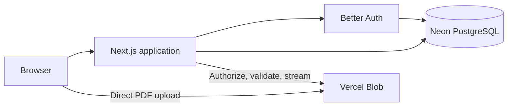

# EZ_ACE Architecture

## Purpose

EZ_ACE is a private exam-preparation web app for one administrator and a small student group. The administrator manages classes, private PDF material, CSV-based exams, students, and analytics. Students read material, take shuffled exams, resume unfinished attempts, and review their latest result.

## System overview



The repository is a single Next.js application. Server Components render most pages and query PostgreSQL directly. Server Actions handle trusted form mutations. Route Handlers provide authentication, JSON APIs, private file access, and direct-upload coordination. Client Components are limited to interactive forms, PDF rendering, and the exam runner.

## Technology

- Next.js 16 App Router, React 19, TypeScript
- Drizzle ORM with Neon PostgreSQL
- Better Auth with username/password and admin plugins
- Private Vercel Blob storage for PDFs
- `csv-parse` for exam import
- PDF.js for first-page previews
- Plain CSS and Lucide icons
- Vercel as intended application host

## Repository layout

```text
src/app/                 Routes, layouts, pages, Route Handlers
src/components/          Shared server/client UI components
src/db/                  Drizzle connection and schema
src/lib/                 Auth, authorization, Server Actions, CSV parsing, scoring
drizzle/                 Versioned PostgreSQL migrations
scripts/seed.ts          Idempotent administrator seed
docs/launch-audit.md     Requirement evidence and launch gates
next.config.ts           Security headers
```

## Runtime boundaries

### Browser

Client code owns only interactions that require browser state:

- `DocumentUpload` validates basic PDF constraints, uploads directly to Vercel Blob, then requests authenticated finalization.
- `PdfCover` loads the protected document endpoint through PDF.js and renders page one to a canvas.
- `ExamRunner` loads attempt data, autosaves each answer, submits the attempt, and navigates to results.
- Auth, password, and student-management forms call server endpoints.

The browser never receives correct answers during an active attempt.

### Next.js server

The application server is the trust boundary. It:

- resolves sessions and enforces student/admin access;
- validates mutations and uploaded file metadata;
- parses CSV files and writes normalized exam rows;
- creates durable shuffled attempt order;
- verifies answer ownership and calculates scores;
- proxies authorized private PDF reads;
- renders dashboards and reports from PostgreSQL.

### External services

- Neon stores auth records, application data, attempt state, and file metadata.
- Vercel Blob stores PDF bytes with private access.
- Better Auth runs inside the Next.js process; it uses the same PostgreSQL database.

## Route and authorization map

| Area | Access | Responsibility |
| --- | --- | --- |
| `/login`, `/signup` | Public | Username/password authentication; signup also requires shared code |
| `/change-password` | Signed in | Mandatory temporary-password replacement |
| `/dashboard`, `/classes/*` | Student or admin | Active classes, materials, published exams |
| `/attempts/*`, `/results/*` | Attempt owner | Exam execution and latest submitted result |
| `/admin/*` | Admin | Classes, documents, exams, users, attempts, analytics |
| `/api/auth/*` | Public/session-aware | Better Auth protocol endpoints |
| `/api/documents/*` | Signed in; upload admin-only | Private PDF upload and streaming |
| `/api/attempts/*` | Attempt owner | Load, autosave, and submit attempts |
| `/api/admin/users` | Admin | Deactivate students and issue temporary passwords |

`requireUser()` redirects unauthenticated users and users who must change their password. `requireAdmin()` adds a role check. Route Handlers perform equivalent explicit checks and return HTTP errors.

## Data model

```mermaid
erDiagram
    USER ||--o{ SESSION : has
    USER ||--o{ ACCOUNT : has
    USER ||--o{ ATTEMPT : makes
    CLASS ||--o{ DOCUMENT : contains
    CLASS ||--o{ EXAM : contains
    EXAM ||--o{ QUESTION : contains
    QUESTION ||--o{ CHOICE : offers
    EXAM ||--o{ ATTEMPT : receives
    ATTEMPT ||--o{ ANSWER : stores
    QUESTION ||--o{ ANSWER : answers
    CHOICE ||--o{ ANSWER : selects
```

Better Auth owns `user`, `session`, `account`, `verification`, and `rate_limit`. Application-specific user flags add role, ban status, mandatory password change, and one-use temporary-password state.

Core application invariants:

- Classes are archived, not deleted.
- Exams move through `draft`, `published`, and terminal `archived` states.
- Questions and choices are normalized; each question has one correct choice from imported data.
- Only one in-progress attempt may exist per user and exam.
- Each attempt stores immutable question and choice order as JSON.
- One answer exists per attempt/question pair and is updated by autosave.
- Submitted attempts retain score, percentage, and timestamp.
- Document rows point to unique private Blob pathnames.

## Main flows

### Signup and authentication

1. Signup handler converts a username into an internal local email.
2. Better Auth verifies the shared signup code with a timing-safe comparison.
3. Username/password login creates a database-backed seven-day session.
4. Rate limits are stored in PostgreSQL.
5. A temporary password works for one login only; the user must replace it before entering the app.

### PDF upload and access

1. Admin browser checks extension-independent PDF MIME, size, and `%PDF-` signature.
2. Upload handler authenticates the admin and grants a limited direct-upload token.
3. Browser sends bytes directly to private Vercel Blob, avoiding the serverless request-body limit.
4. Server finalization checks class state, Blob metadata, signature, 25 MB file limit, and 750 MB global cap.
5. A PostgreSQL advisory lock prevents concurrent uploads from exceeding the cap.
6. Authenticated document endpoint streams the private Blob with range and cache headers for preview or download.

### Exam import and publication

1. Admin uploads a CSV of at most 1 MB and 100 questions.
2. Parser requires exact headers, all values, valid `A`–`D` answers, and no duplicate rows.
3. One batch inserts draft exam, questions, and choices while preserving source CSV.
4. Admin previews the normalized exam and publishes it.
5. Students see only published exams in active classes.

### Attempt lifecycle

1. `startAttempt` resumes an existing in-progress attempt or creates one.
2. Server shuffles question and choice IDs once and persists both orders.
3. Client fetches text and shuffled choices without correctness flags.
4. Each selection is validated against persisted order and upserted.
5. Submission reads correct choice IDs on the server, scores saved answers, and marks the attempt submitted.
6. Students can review only their latest submitted attempt per exam; admins can inspect all attempts.

## Security model

- Every protected page and mutation checks the server-side session.
- Admin role checks protect management routes and upload token creation.
- Attempt APIs require ownership and validate question/choice membership.
- Correct-answer flags stay server-side until result rendering.
- PDFs remain private and are served only through authenticated endpoints.
- Signup/admin seed secrets use timing-safe comparisons.
- Password reset revokes other sessions and forces immediate password replacement.
- Content Security Policy, HSTS, frame denial, MIME sniffing prevention, referrer policy, and permissions policy are configured globally.
- Uploaded filenames and download headers are sanitized.

## Deployment and operations

Required environment variables are documented in `.env.example`:

- `DATABASE_URL`
- `BETTER_AUTH_SECRET`
- `BETTER_AUTH_URL`
- `SIGNUP_CODE`
- `ADMIN_USERNAME`
- `ADMIN_PASSWORD`
- `BLOB_READ_WRITE_TOKEN`

Deployment sequence:

1. Provision Neon and a private Vercel Blob store.
2. Configure environment variables per Vercel environment.
3. Run `npm run db:migrate`.
4. Run `npm run db:seed` once; reruns are safe for the configured admin username.
5. Deploy and run the pilot checks listed in `docs/launch-audit.md`.

Useful checks:

```bash
npm test
npm run lint
npx tsc --noEmit
npm run build
```

## Deliberate constraints

- Single application and single database; no service split or queue.
- One global PDF upload lock; sufficient for low admin upload volume.
- Shared signup code instead of invitations or email delivery.
- Analytics are calculated during page rendering; no warehouse or materialized views.
- PDF deletion is not implemented, preserving uploaded study material and avoiding destructive admin flows.
